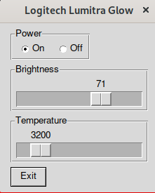

# Python Utility for Logitech Litra Glow and Beam
[](https://badge.fury.io/py/litra-driver)

## Introduction

After purchasing a [Logitech Litra Glow](https://www.logitech.com/en-us/products/lighting/litra-glow.946-000001.html) I was unable to find any support for linux. This project reverse-engineers the basic functionality of the litra glow so that we can control it via USB without using the physical buttons on the device. It also now supports the [Logitech Litra Beam](https://www.logitech.com/en-us/products/lighting/litra-beam.946-000006.html).

## Quick Start

### Linux
```bash
# If necessary, create a udev role to grant permission to access the light
sudo tee /etc/udev/rules.d/82-litra-glow.rules <<< 'SUBSYSTEM=="usb", ATTR{idVendor}=="046d", ATTR{idProduct}=="c900",MODE="0666"'
sudo tee /etc/udev/rules.d/82-litra-beam.rules <<< 'SUBSYSTEM=="usb", ATTR{idVendor}=="046d", ATTR{idProduct}=="c901",MODE="0666"'

# For most operating systems, reloading udev rules is enough
sudo udevadm control --reload-rules
sudo udevadm trigger

# For others, a reboot may be required
# sudo reboot

# Uninstall if previously installed
pip uninstall litra-driver
pip install litra-driver

# Command Line Interface
lc --help

# User Interface
lcui

```

#### Fedora Dependencies

The following dependencies may need to be installed for the UI. This was specifically noted on Fedora 37:

```bash
sudo dnf install -y python3-tkinter libappindicator-gtk3
```

#### Ubuntu Dependencies

The following dependencies may need to be installed for the UI. This was specifically noted on ubuntu 20.04:

```bash
sudo apt-get install -y python3-tk gir1.2-appindicator3-0.1
```

## The UI
A basic UI can be launched to allow control of the light:

```bash
lcui
```


## The CLI

```
NAME
    lc

SYNOPSIS
    lc COMMAND

COMMANDS
    COMMAND is one of the following:

     on
       Turns on the Litra Glow

     off
       Turns off the Litra Glow

     temp
       Sets the temperature level of the Litra Glow

     bright
       Sets the brightness level of the Litra Glow
```

Sample Usage
```bash
lc on
lc bright 10
lc temp 6500
lc off

# Chain multiple commands
lc on bright 100 temp 2700
```

The log level can be adjusted by setting the environment variable `LITRA_LOGLEVEL` to one of the following:
* CRITICAL
* ERROR
* WARNING
* INFO
* DEBUG

## Development
### Creating / installing the distribution

```bash
pip install build

# Create distribution
python -m build

# Local Testing
pip install --editable .

# Linter
tox -e lint

# Unit Test - "Coming Soon"™
tox -e test

# Push to pypi 
pip install twine
twine check dist/*
twine upload dist/*
```
